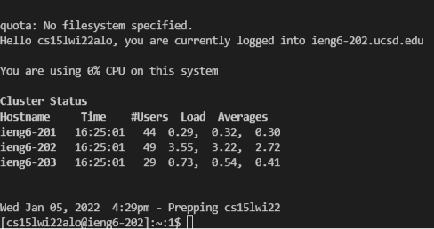

# Lab 1 Report by Pratyush Chand

# Installing VS Code
Navigate to this [Visual Studio Code Download Link](https://code.visualstudio.com/) and follow instructions to download. 
Upon successfully downloading your opening visual studio window should look something like this:


# Remotely Connecting

If you are on windows, install OpenSSH client and server: [Install OpenSSH](https://docs.microsoft.com/en-us/windows-server/administration/openssh/openssh_install_firstuse)

Look up your course specific ID here: [Look up my Course ID](https://sdacs.ucsd.edu/~icc/index.php)

Next open up a "new Terminal" in VS Code and enter the following command but replace zz with letters in your course specific ID:
```
ssh cs15lwi22zz@ieng6.ucsd.edu
```
**After a successful connection, you should see something like this:**



# Trying some commands
There are numerous commands you can run on the server-side through your terminal. A short list is below:

* ls command lists files in current directory
* ls -l lists all files in the current directory plus additional info such as last edited 
* ls -a lists all files including hidden files in the current directory
* ls -lat lists all files including hidden files in current directory and provides additional info
* pwd gives absolute path of directory
* cd by itself takes you back to the home directory
* mkdir creates a new folder
* rmdir removes a directory
* touch creates a new file
* rm removes a file
* exit disconnects from server

A working example of a few commands is below:


# Moving Files w/ SCP

Let's start by creating a java file on our local computer. We will call it "WhereAmI.java" and it should look something like this:


Next, in the terminal of your current directory, run the following command on the client-side:
 ```
scp WhereAmI.java cs15lwi22zz@ieng6.ucsd.edu:~/
 ```

 Now, try logging in with SSH again. Upon a successful connection to the server, type in the `ls command`. You should now see the WhereAmI.java file in your directory. You can also go ahead and try running that file on the server with javac and java commands and it would look something like this:

 

 # Setting an SSH Key

 In order to save time and not keep typing in your passwords to run commands like ssh or scp, we will be using keygen to create a pair of public and private keys. These keys will be stored on the client and server side and moving forward, ssh will be able to use this keys automatically!

 Here's the commands you should type in your terminal:
 ```
$ ssh-keygen
Generating public/private rsa key pair.
Enter file in which to save the key (/Users/Praty/.ssh/id_rsa): /Users/Praty/.ssh/id_rsa
Enter passphrase (leave this field empty): 
Enter same passphrase again (again leave this empty): 
Your identification has been saved in /Users/Praty/.ssh/id_rsa.
Your public key has been saved in /Users/Praty/.ssh/id_rsa.pub.
The key fingerprint is:
SHA256:jZaZH6fI8E2I1D35hnvGeBePQ4ELOf2Ge+G0XknoXp0 Praty@PratyushWindows.local
The key's randomart image is:
+---[RSA 3072]----+
|                 |
|       . . + .   |
|      . . B o .  |
|     . . B * +.. |
|      o S = *.B. |
|       = = O.*.*+|
|        + * *.BE+|
|           +.+.o |
|             ..  |
+----[SHA256]-----+
 ```

Now, if you try running a secure connection to the server again, you will notice how you don't have to enter a password. Here's what happens:


# Optimizing Remote Running

There are many different ways you can optimize remote running to minimize redundant input. I will just be covering the `alias` command

Let's say I want to run "java WhereAmI" (from earlier step) over and over again. Well instead of typing the entire command repeatedly, I can store it as an alias using the following command:

```
alias new="java WhereAmI"
```

After executing this in the terminal, you can just type in "new" instead of "java WhereAmI" over and over again. Here's what it looks like:

