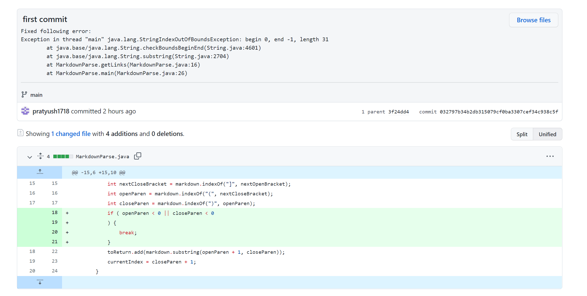
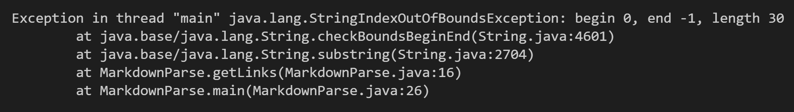
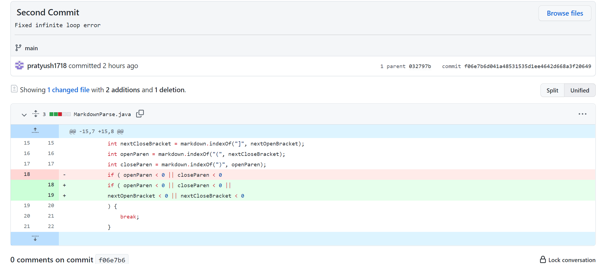
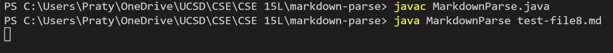
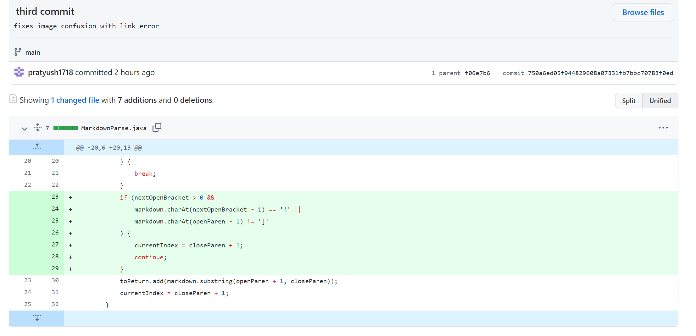
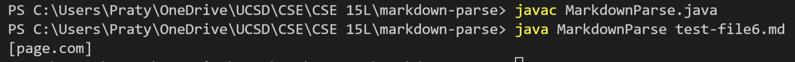

# Lab 2 Report by Pratyush Chand

## Code Change Issue 1: Missing Parantheses

[Link to the file with failure inducing input](test-file4.md)

The symptom we got was that there was an IndexOutOfBoundsException when the failure inducing file was used. That file had a link but it wasn't surrounded in parantheses--as such, this created a bug since we ran .indexOf() for parantheses and this would end up returning -1. And since we can't take a substring from a negative index, we got the symptom we see. 

## Code Change Issue 2: Miscellaneous Bracket

[Link to the file with failure inducing input](test-file8.md)

The symptom we got was an infine loop. The file had an extra bracket at the end and this created a bug since we ran .indexOf() for brackets as well. Since we didn't have a closing bracket, .indexOf() would return -1 and we would neither be able to break from the while loop nor return a proper link. As such, we got our symptom of being stuck in an infine loop.

## Code Change Issue 3: Imagie and Link Confusion

[Link to the file with failure inducing input](test-file6.md)

The symptom was that MarkdownParse printed that "page.com" was a link--when in reality it wasn't. The failure inducing file had an image reference and since our program only looks between the parantheses, it created a bug and read the image like it was a link (bug in this case is that our program categorizes all things between parantheses as a link). As such, we see the symptom that "page.com" is a link.