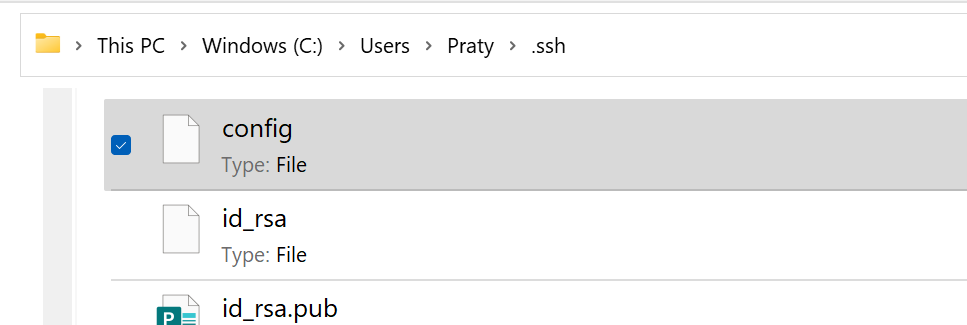
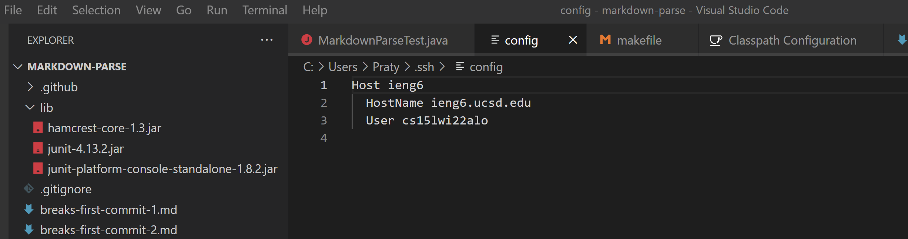
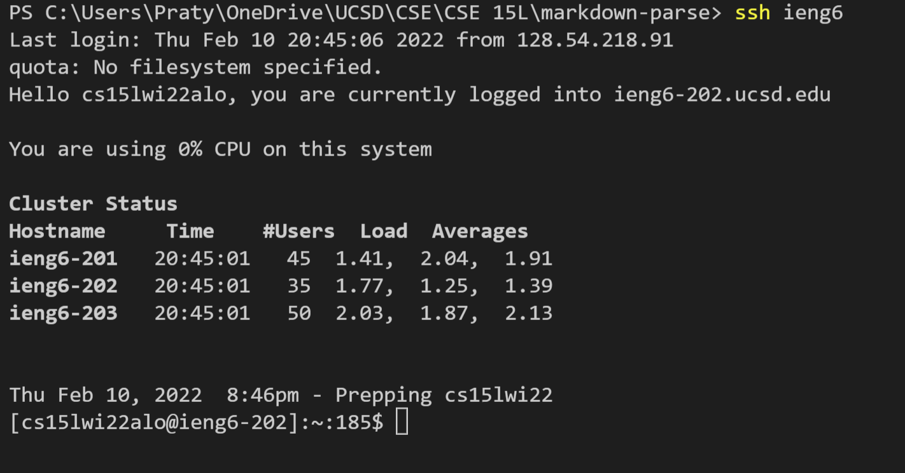
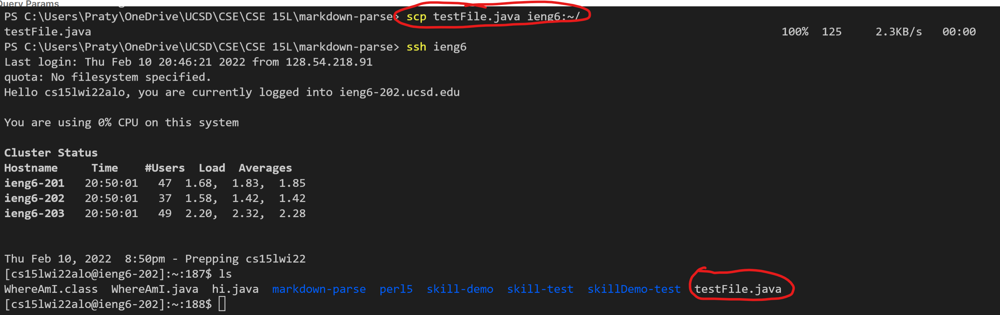

# Lab Report 3 by Pratyush Chand

# Option 1: Streamlining ssh Configuration

## .ssh/config file location & editing in VS code


The image above is the config file in the file explorer.


The image above shows the config file open in VS code after I changed the alias to just "ieng6"


## SSH login w/ alias



The image above is a successful login using ```ssh``` with the "ieng6" alias

## SCP command w/ alias
Before testing the ```scp``` command, I first created a testFile.java file with the following code:
```
public class testFile {
    public static void main(String [] args){
        System.out.println("hello");
    }    
}
```

Next, I copied it over using the alias as a shorcut

In the image, I have a circled the command and I also did an ssh login again and ran the ```ls``` command to ensure the file was copied over successfully (that is circled as well).