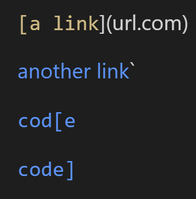
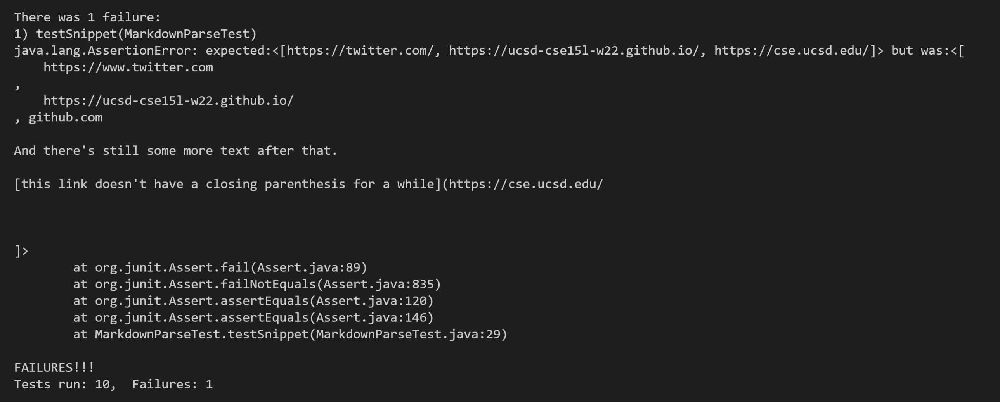

# Lab 4 Report by Pratyush Chand

[My MarkdownParse repo](https://github.com/pratyush1718/markdown-parse)

[Reviewed MarkdownParse repo](https://github.com/annakkin/markdown-parse)

# Snippet #1

For snippet one, here's the expected output:


There are 3 expected links: `google.com, google.com, ucsd.edu


How I turned it into a test in MarkdownTest.java:
```
@Test
    public void testSnippet() throws IOException{
        String contents = Files.readString(Path.of("./snippet-one.md"));
        List<String> expectedList = List.of("`google.com", "google.com", "ucsd.edu");
        assertEquals(expectedList, MarkdownParse.getLinks(contents));
    }
```

Output for my implementation:


Output for reviewed implementation:


## Can it be fixed with a small code change?

Yes this can be fixed with a small code change. As we can see, out of the 4 inputs, 3 of them are successfull links. The only case it doesn't work is when the backticks are before the first closed bracket and before the second one. Just the way we did with images, we could check for a backtick before the first closed bracket, and if it exists, we ignore everything until the next backtick. If the first backtick comes after the first closed bracket, it's still a valid link.


# Snippet 2

For snippet two, here's the expected output:


There are 3 expected links: a.com, a.com(()), and example.com

How I turned it into a test in MarkdownTest.java:
```
@Test
    public void testSnippet() throws IOException{
        String contents = Files.readString(Path.of("./snippet-two.md"));
        List<String> expectedList = List.of("a.com", "a.com(())", "example.com");
        assertEquals(expectedList, MarkdownParse.getLinks(contents));
    }
```

Output for my implementation:


Output for reviewed implementation:


## Can it be fixed with a small code change?

I think this can also be fixed with a small code change. My version of MarkdownParse seems to detect nested brackets and nested links fairly accurately. The only issue it has is with nested parantheses. If we add some conditionals, however, to only count nested parantheses that have closed brackets before them as links, we can solve that issue. Currently, we keep reseting the value of openParen because there are nested parantheses. But if we added a check to only reset that value if brackets immediately preceded them, we wouldn't catch the same problem and we wouldn't be trying to aimlessly search for a link inside the nested parantheses. 

# Snippet 3

For snippet two, here's the expected output:


There are 3 expected links: https://twitter.com/, https://ucsd-cse15l-w22.github.io/, and https://cse.ucsd.edu/

How I turned it into a test in MarkdownTest.java:
```
 @Test
    public void testSnippet() throws IOException{
        String contents = Files.readString(Path.of("./snippet-three.md"));
        List<String> expectedList = List.of("https://twitter.com/", "https://ucsd-cse15l-w22.github.io/", "https://cse.ucsd.edu/");
        assertEquals(expectedList, MarkdownParse.getLinks(contents));
    }
```

Output for my implementation:


Output for reviewed implementation:


## Can it be fixed with a small code change?

Yeah I also believe this can be fixed with a small code change. Clearly, the problem here is that there are miscalenneous spaces and line breaks. However, if we simply gathered our links and before adding them to the returning list conducted a .split by new line or space operation, our links would be as expected (without random line breaks and spaces).

