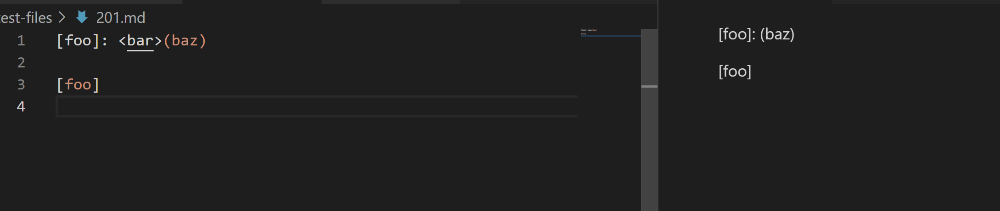
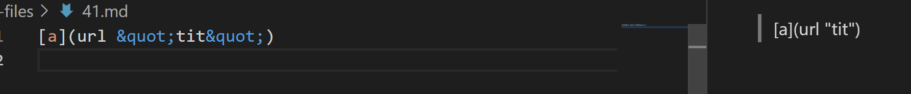

# Lab 5 Report by Pratyush Chand

# How did I find the tests with different results?

I used `diff` on the results.txt of the two repositories (which was obviously obtained by running a bash for loop and storing the outputs)

# Test 1
Since the issue occurs in test file 201.md, we can compare the expected and actual output.

Expected output:
[]

 As we can see in the image below, there are no links



Actual output:


As we can see, my repo found no links while the provided one did find a link-- "baz". Since we expected no links, my repo is correct. 

The bug in the provided repo is that it ignores the nonsense between the last closing bracket and the first open paren. Since there are characters between the last closing bracket and the first open paren, this invalidates the link--but the provided repo isn't able to catch that because it never checks for that in its if statement. Below is the problematic code from the provided repo: 

```
if(potentialLink.indexOf(" ") == -1 && potentialLink.indexOf("\n") == -1) {
                toReturn.add(potentialLink);
                currentIndex = closeParen + 1;
            }
```

This is problematic because there is no place to check that the last closing bracket occurs right before the first opening paren.

# Test 2
Since the issue occurs in test file 41.md, we can compare the expected and actual output.

Expected output:
[]

 As we can see in the image below, there are no links



Actual output:


As we can see, the provided repo found no links while mine did find a link-- "url &quot;tit&quot". Since we expected no links, the provided repo is correct. 

The bug in my repo is that it if there are spaces within the parantheses, it still considers that as valid part of the link--even when it shouldn't be, of course. Below is the problematic code from my repo:

```
 if (nextOpenBracket > 0 &&
                markdown.charAt(nextOpenBracket - 1) == '!' ||
                markdown.charAt(openParen - 1) != ']'
            ) {
                currentIndex = closeParen + 1;
                continue;
            }
            toReturn.add(markdown.substring(openParen + 1, closeParen));
            currentIndex = closeParen + 1;
        }
```
This is problematic since there is no way to check that the information within the parantheses has no spaces.

